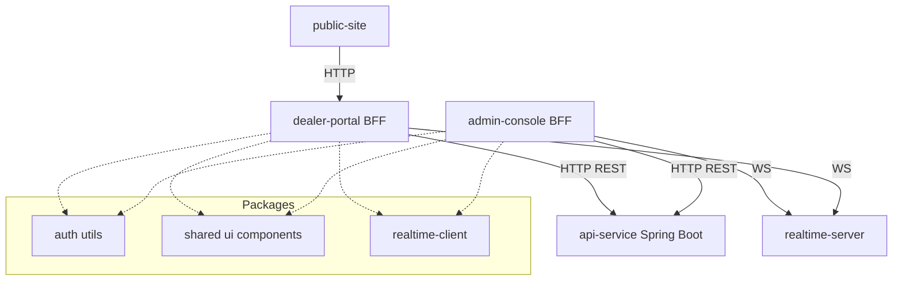

# Grota Financiamentos - Sistema Integrado

Este repositório contém o ecossistema completo do **Grota Financiamentos de Veículos**, organizado em um monorepo gerenciado pelo **Turborepo**. O projeto engloba desde o site institucional até os painéis administrativos e a API core de serviços

- **Next.js 15/16** (App Router)
- **TypeScript**
- **Tailwind CSS** (Estilização)
- **Ant Design** & **Shadcn/UI** (Componentes de interface)
- **Lucide React** (Ícones)
- **Pnpm** (Gerenciador de pacotes)

- **Spring Boot (Java)** (API Core)
- **Maven** (Build Tool)
- **Node.js + WebSockets** (Sincronização em tempo real)
- **AES-GCM Encryption** (Segurança de sessão compartilhada)

### Infraestrutura & DevOps

- **Turborepo** (Orquestração de monorepo)
- **Playwright** (Testes End-to-End)
- **Docker** (Conteinerização)
- **Jenkins** (CI/CD)

---

## 🏗️ Arquitetura do Projeto

O sistema utiliza o padrão **BFF (Backend For Frontend)** em seus painéis para garantir segurança, isolamento de sessões e facilidade de integração.



---

## 📁 Módulos do Projeto

### Aplicações (`apps/`)

| Módulo          | Descrição                                                                          | Tecnologia    |
| --------------- | ---------------------------------------------------------------------------------- | ------------- |
| `public-site`   | Landing page institucional, captação de leads e onboarding de lojistas.            | Next.js       |
| `dealer-portal` | Painel exclusivo do lojista para gestão de estoque, propostas e documentos.        | Next.js (BFF) |
| `admin-console` | CRM interno para operadores Grota. Gestão de contratos, análise de crédito e BI.   | Next.js (BFF) |
| `api-service`   | Backend centralizador das regras de negócio, persistência e integrações bancárias. | Spring Boot   |
| `e2e-tests`     | Suíte de testes automatizados para garantir a integridade dos fluxos críticos.     | Playwright    |

### Pacotes Compartilhados (`packages/`)

| Pacote                                | Função                                                                               |
| ------------------------------------- | ------------------------------------------------------------------------------------ |
| `auth`                                | Lógica de criptografia de sessão e utilitários de segurança entre os painéis.        |
| `ui`                                  | Biblioteca de componentes visuais reutilizáveis seguindo o Design System do projeto. |
| `realtime-server`                     | Servidor WebSocket para notificações instantâneas e sync de dados.                   |
| `realtime-client`                     | Hooks e utilitários para conexão e consumo de eventos em tempo real.                 |
| `eslint-config` / `typescript-config` | Padronização de código e configurações de build compartilhadas.                      |

---

## 💡 Lógica e Fluxos Principais

### 1. Fluxo de Autenticação (BFF Pattern)

Para evitar exposição de tokens no navegador, os painéis (`dealer-portal` e `admin-console`) atuam como BFF.

- O frontend envia as credenciais para o próprio `/api/auth/login`.
- O servidor do painel encaminha para o `api-service`.
- Ao receber o token do Spring, o BFF gera um cookie **HttpOnly** e seguro, cifrando os dados da sessão.
- O middleware do Next.js valida este cookie em cada requisição de página.

### 2. Esteira de Propostas em Tempo Real

Sempre que uma proposta é criada ou tem seu status alterado:

1. A alteração é persistida no `api-service`.
2. O `admin-console` ou `dealer-portal` dispara um evento via `realtime-server`.
3. Todos os usuários conectados no canal relevante recebem a atualização instantaneamente sem necessidade de refresh.

### 3. Gestão de Documentos

O sistema possui um fluxo de upload direto pelo lojista e análise pelo backoffice (Admin). Os documentos passam por estados de "Pendente", "Em Análise", "Aprovado" ou "Recusado" com feedback visual imediato.

### 4. Gestão de Cobranças - Controle Inteligente (Gemini)

Novo modulo de monitoramento em `admin-console` com rota `/cobrancas/inteligencia`, focado em:

- KPIs de carteira (total em aberto, aging, forecast de recuperacao).
- Priorizacao de titulos por risco + valor + atraso.
- Alertas por severidade (`info`, `atencao`, `critico`) com anti-spam por cliente.
- Analise IA (Gemini) com cache TTL de 6h por titulo/cliente.
- Fallback automatico quando IA indisponivel.

#### Endpoints BFF (admin-console)

- `GET /api/cobrancas/inteligencia`
- `GET /api/cobrancas/alerts`
- `POST /api/cobrancas/ia/analisar`

#### Endpoints Core (api-service)

- `GET /api/v1/grota-financiamentos/billing/intelligence`
- `GET /api/v1/grota-financiamentos/billing/alerts`
- `POST /api/v1/grota-financiamentos/billing/ia/analisar`

#### Exemplo - analisar titulo via IA

Request:

```json
{
  "contractId": 125,
  "installmentNumber": 3,
  "forceRefresh": true
}
```

Response:

```json
{
  "contractId": 125,
  "installmentNumber": 3,
  "riskLevel": "alto",
  "riskScore": 82,
  "recommendedNextAction": "Contato imediato e proposta de negociacao com prazo curto.",
  "recommendedChannel": "whatsapp",
  "alertReason": "Atraso relevante e indicios de reincidencia.",
  "suggestedMessage": "Identificamos atraso no seu titulo. Podemos negociar hoje para evitar agravamento.",
  "source": "gemini",
  "createdAt": "2026-02-21T11:15:00"
}
```

#### Exemplo - filtros de inteligencia

`GET /api/cobrancas/inteligencia?client=joao&periodFrom=2026-01-01&periodTo=2026-02-21&status=EM_ATRASO&aging=16-30&minValue=500&risk=alto`

#### Variaveis de ambiente

- `GEMINI_API_KEY`: chave para uso da IA Gemini.
- `BILLING_INTELLIGENCE_CACHE_TTL_HOURS`: TTL do cache de insights (padrao `6`).
- `BILLING_INTELLIGENCE_ALERT_COOLDOWN_HOURS`: janela anti-spam por cliente (padrao `6`).
- `BILLING_INTELLIGENCE_HIGH_VALUE_THRESHOLD`: limiar de valor para severidade atencao (padrao `5000`).

---

## 🛠️ Como Executar

### Pré-requisitos

- Node.js 18+
- Java 17+
- Pnpm 9+

### Instalação

```bash
pnpm install
```

### Desenvolvimento

Para rodar todos os serviços simultaneamente:

```bash
pnpm dev
```

Para rodar um módulo específico:

```bash
pnpm --filter dealer-portal dev
```

Para rodar o backend (Spring Boot):

```bash
pnpm run-java
```

---

## 📄 Documentação Adicional

- [Arquitetura Detalhada](./Arquitetura.md)
- [Endpoints da API](./Arquitetura.md#apis-rest)
