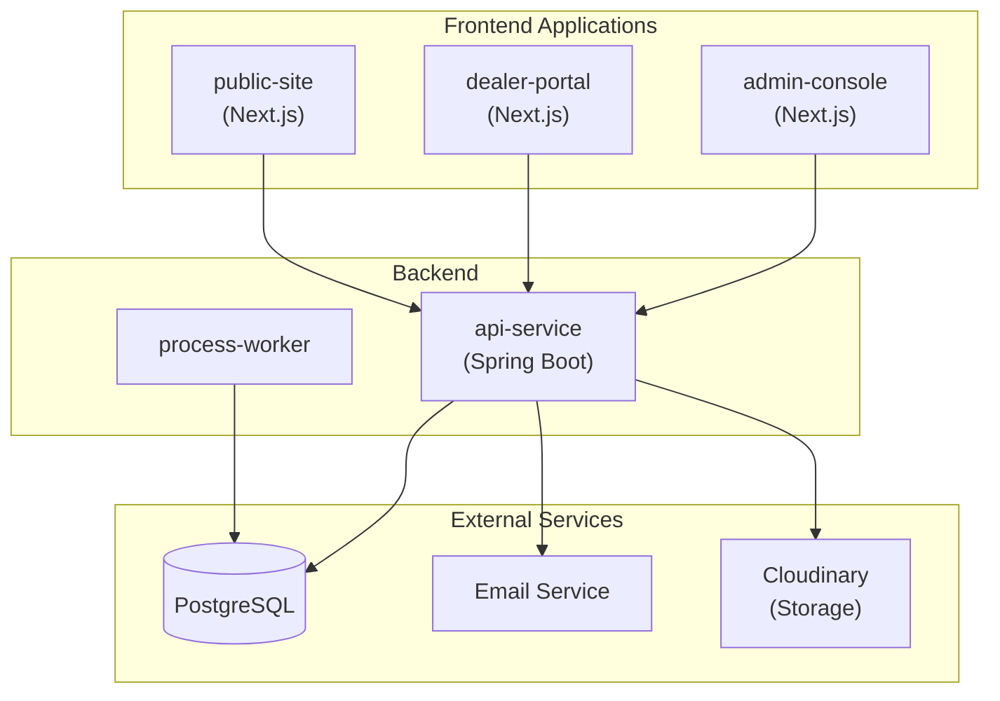
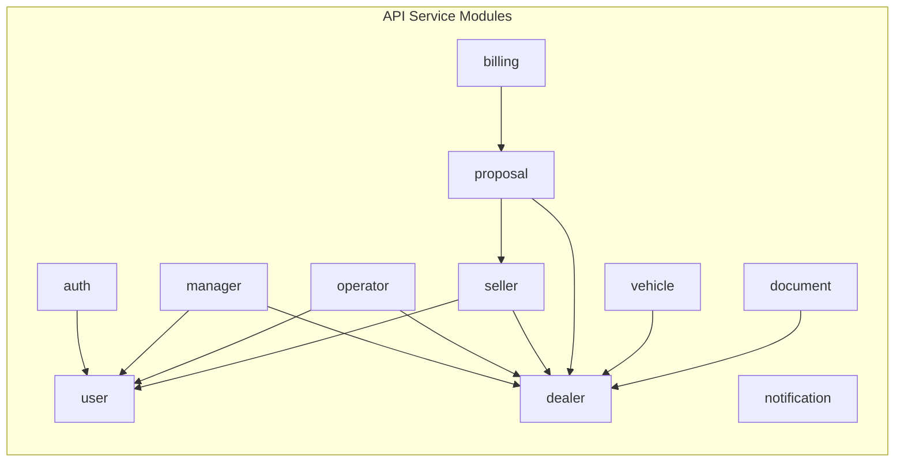
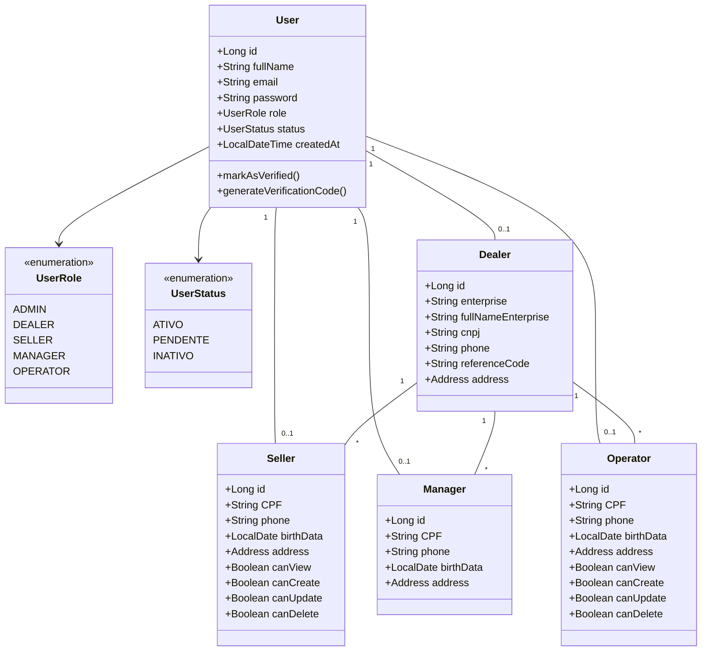
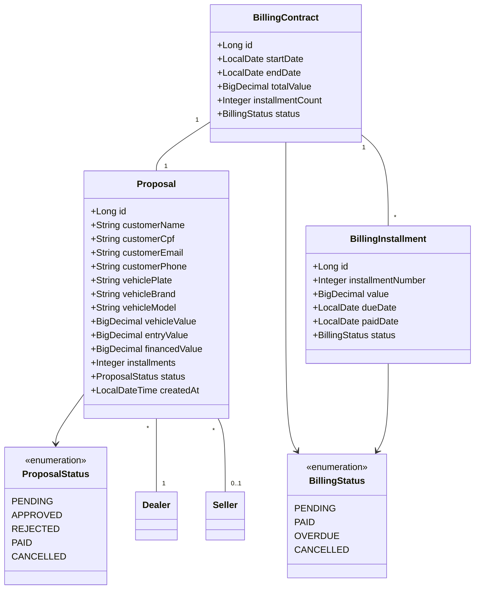
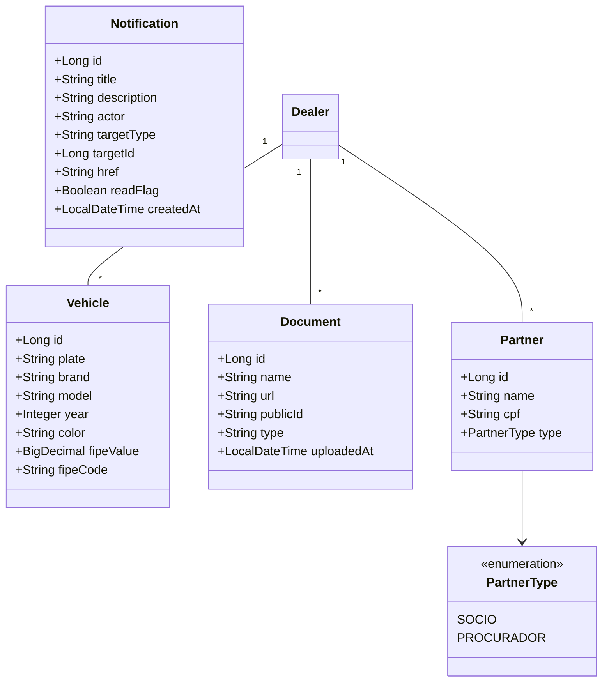
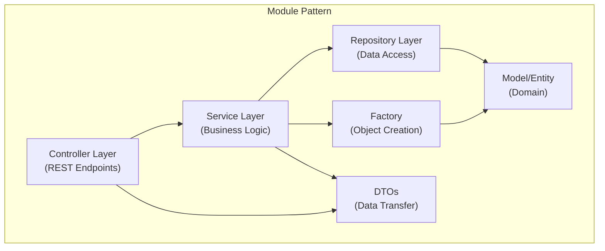
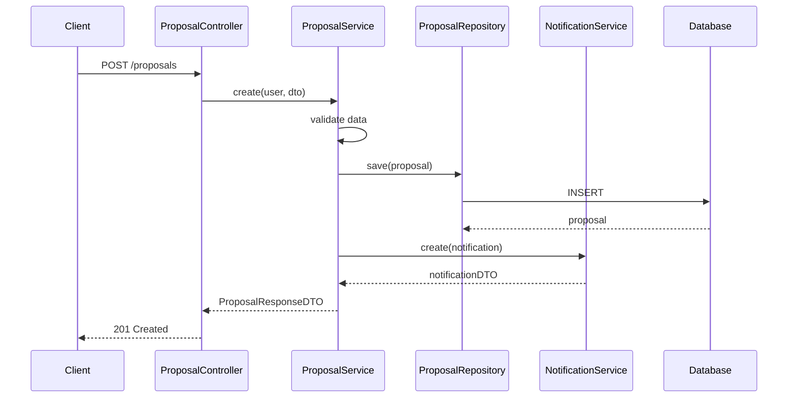
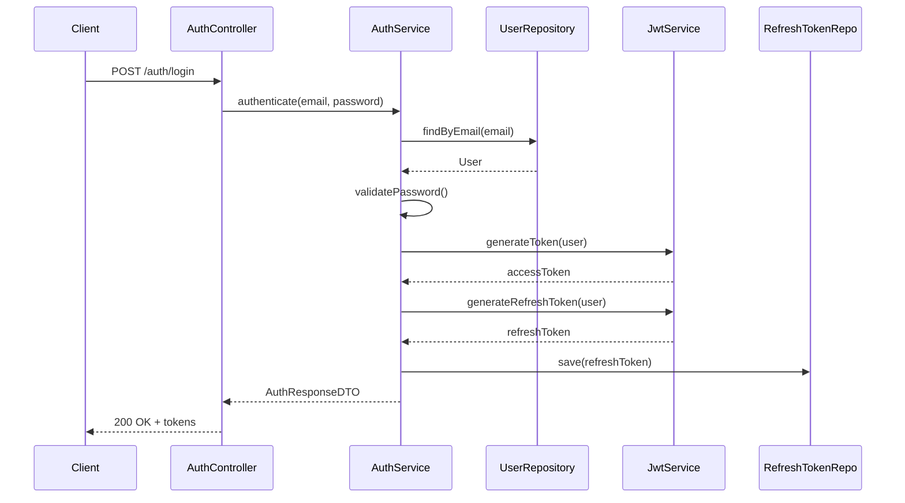
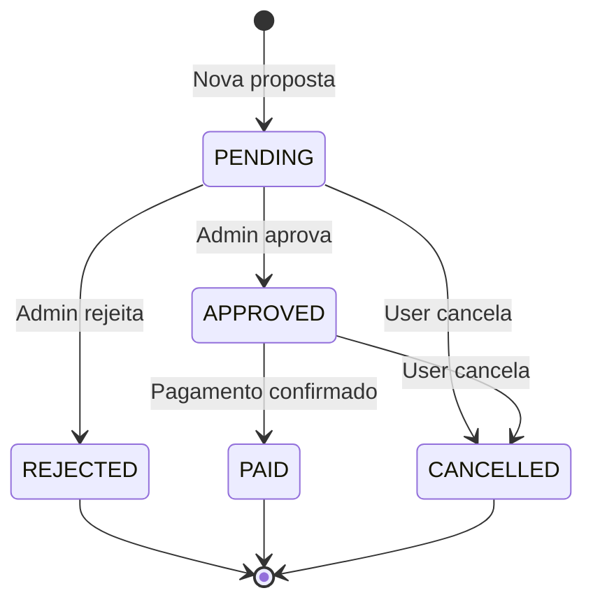

# Arquitetura UML - Grota Financiamentos

Sistema de financiamento veicular com painel administrativo, portal de lojistas e site público.

---

## 1. Visão Geral do Sistema



---

## 2. Diagrama de Componentes (Backend)



---

## 3. Diagrama de Classes - Entidades Principais



---

## 4. Diagrama de Classes - Proposta e Cobrança



---

## 5. Diagrama de Classes - Veículos e Documentos



---

## 6. Arquitetura em Camadas (Por Módulo)



---

## 7. Diagrama de Sequência - Criação de Proposta



---

## 8. Diagrama de Sequência - Autenticação



---

## 9. Diagrama de Fluxo - Atualização de Status de Proposta



---

## 10. Relacionamentos Entre Entidades

| Entidade        | Relacionamento | Entidade           |
| --------------- | -------------- | ------------------ |
| User            | 1:1            | Dealer             |
| User            | 1:1            | Seller             |
| User            | 1:1            | Manager            |
| User            | 1:1            | Operator           |
| Dealer          | 1:N            | Seller             |
| Dealer          | 1:N            | Manager            |
| Dealer          | 1:N            | Operator           |
| Dealer          | 1:N            | Vehicle            |
| Dealer          | 1:N            | Document           |
| Dealer          | 1:N            | Partner            |
| Dealer          | 1:N            | Proposal           |
| Seller          | 1:N            | Proposal           |
| Proposal        | 1:1            | BillingContract    |
| BillingContract | 1:N            | BillingInstallment |

---

## 11. Estrutura de Diretórios do Backend

```
api-service/src/main/java/org/example/server/
├── core/
│   ├── email/          # EmailService
│   ├── exception/      # Global exceptions
│   └── util/           # Utilities
├── modules/
│   ├── auth/           # Authentication & Security
│   ├── billing/        # Contracts & Installments
│   ├── dealer/         # Dealer management
│   ├── document/       # Document uploads
│   ├── manager/        # Manager CRUD
│   ├── notification/   # Notification system
│   ├── operator/       # Operator CRUD
│   ├── proposal/       # Proposal workflow
│   ├── seller/         # Seller CRUD
│   ├── user/           # User management
│   └── vehicle/        # Vehicle catalog
└── shared/
    └── address/        # Embedded Address
```

---

## 12. Tecnologias Utilizadas

| Camada       | Tecnologias                                            |
| ------------ | ------------------------------------------------------ |
| **Frontend** | Next.js 14, React, TypeScript, Ant Design, TailwindCSS |
| **Backend**  | Java 21, Spring Boot 3, Spring Security, JPA/Hibernate |
| **Database** | PostgreSQL                                             |
| **Auth**     | JWT (Access + Refresh Tokens)                          |
| **Storage**  | Cloudinary                                             |
| **Build**    | Turborepo, pnpm, Maven                                 |
| **CI/CD**    | Jenkins                                                |
