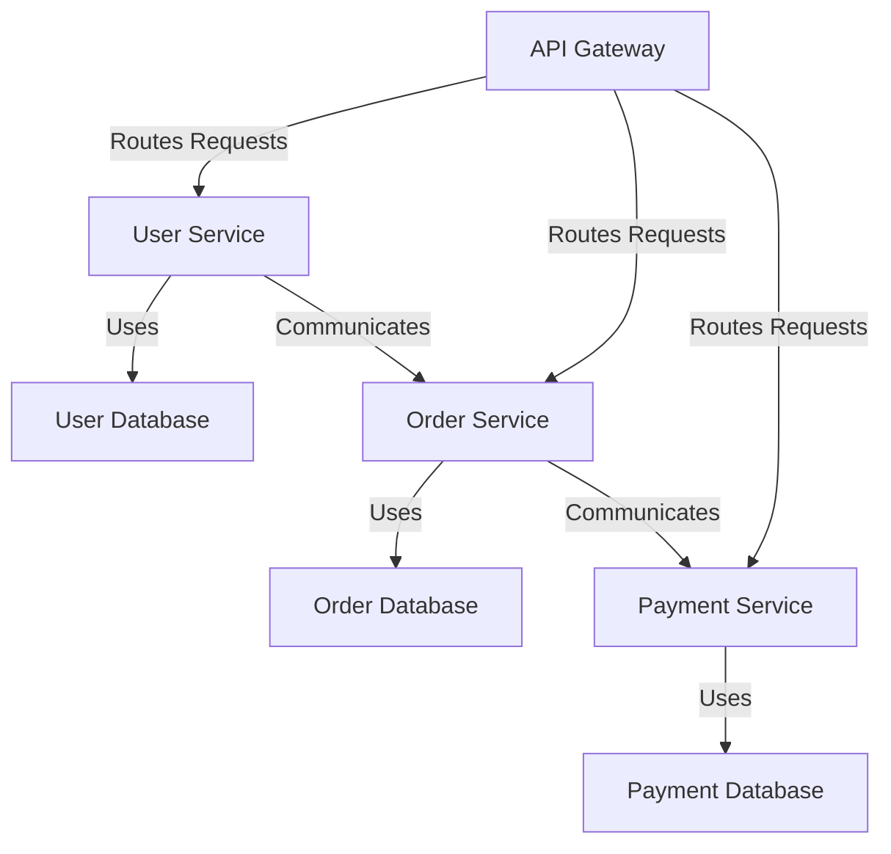

# Microservices Architecture Diagram

## Description
- **API Gateway**: Central entry point for all client requests.
- **User Service**: Manages user data and authentication.
- **Order Service**: Handles order processing and management.
- **Payment Service**: Manages payment transactions.
- **Databases**: Each service has its own database for data isolation.

## Interactions
- The API Gateway routes requests to the appropriate service.
- Services communicate with each other as needed, maintaining loose coupling.

